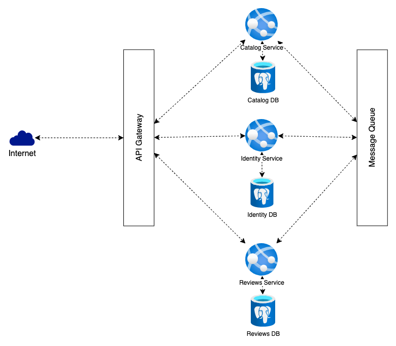

# WineMate 🍷

> A server-side application for storing information about wines, their producers and your reviews


## Features
- Catalog of wines
- Catalog of wine makers
- Reviews of wines
- User system with authentication and authorization

## Run the application

- Prerequisites
  - Docker [(download here)](https://docs.docker.com/get-docker/)
  - .NET 8.0 SDK [(download here)](https://dotnet.microsoft.com/download/dotnet/8.0)
    - Entity Framework Core CLI [(download here)](https://docs.microsoft.com/en-us/ef/core/cli/dotnet)

After cloning the repository, you can start the application by starting the services
```bash
docker-compose up
```

After the infrastructure is set up, you might need to run the migrations
```bash
dotnet ef database update
```

After initial set-up the application is accessible at port `:8000` via the API gateway.


## Services
Application is composed of the following services. Here's how you can access them.

| Service     | Port     |
|-------------|----------|
| API Gateway | `:8000`  |
| Catalog     | `:8100`  |
| Reviews     | `:8200`  |
| Identity    | `:8300`  |



## Used technologies
- .NET 8.0
- Entity Framework Core - ORM
- PostgreSQL - Database
- Docker - Containerization
- RabbitMQ - Message broker
- YARP - API Gateway